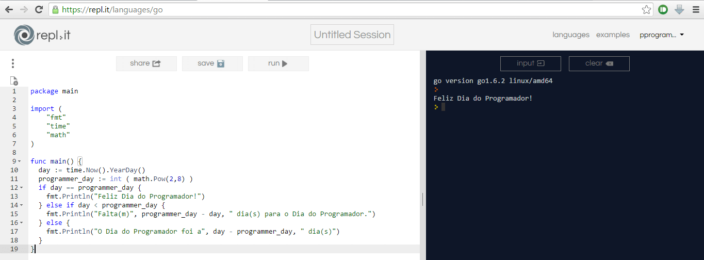
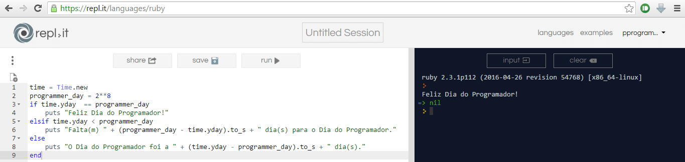
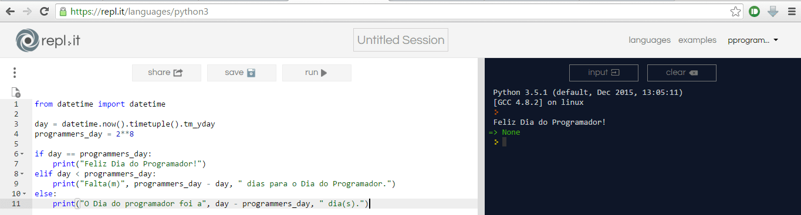
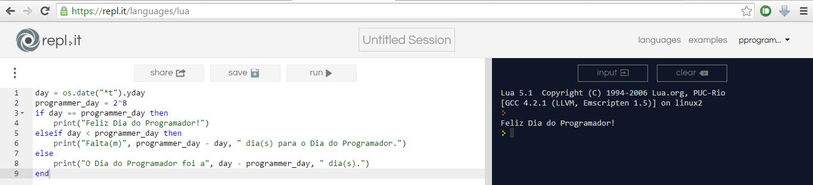
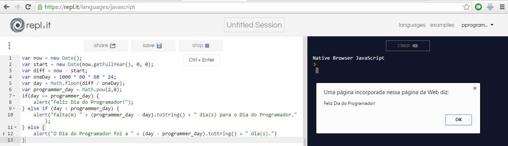
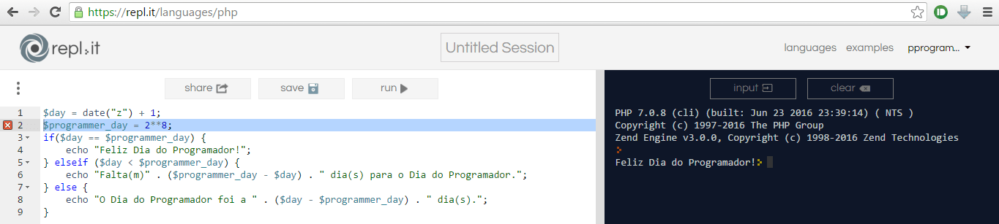
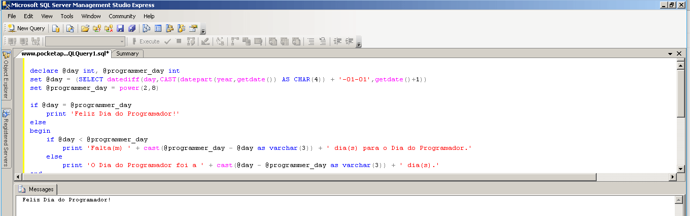

# Happy Programmers' Day
In celebration of Programmers' Day, a small greeting in several languages :)

The Programmer's Day is internationally recognized and celebrated on the 256 each year.
The number 256 for the number of distinct values that can be represented with a byte of eight bits, a well known value for developers and also be the highest power of two (high to eight), which is less than 365 ( number of days in a year).
[Wikipedia](https://en.wikipedia.org/wiki/Day_of_the_Programmer)

All pieces of code can be tested online at [https://repl.it](https://repl.it) (except T-SQL)

## Languages used:
* GO
* Ruby
* Python
* Lua
* Javascript
* PHP
* T-SQL (Transact SQL / SQL Server)

The basic idea of each code is to get the day of the year (1-365) and compare with the Programmers' Day (calculating the power 2 increased to 8). Compare day obtained and display messages if they are equal, if the current day is less than or greater than 256.

## Show me the code...

### GO
```go
package main

import (
	"fmt"
	"time"
	"math"
)

func main() {
  day := time.Now().YearDay()
  programmer_day := int ( math.Pow(2,8) )
  if day == programmer_day {
  	fmt.Println("Happy Programmers' Day!")
  } else if day < programmer_day {
  	fmt.Println(programmer_day - day, " day(s) left to Programmers' Day.")
  } else {
  	fmt.Println("The Programmers' Day was ", day - programmer_day, " day(s).")
  }
}
```

### Ruby
```ruby
time = Time.new
programmer_day = 2**8
if time.yday  == programmer_day
	puts "Happy Programmers' Day!"
elsif time.yday < programmer_day
	puts (programmer_day - time.yday).to_s + " day(s) left to Programmers' Day."
else
	puts "The Programmers' Day was " + (time.yday - programmer_day).to_s + " day(s)."
end
```

### Python
```python
from datetime import datetime

day = datetime.now().timetuple().tm_yday
programmers_day = 2**8

if day == programmers_day:
	print("Happy Programmers' Day!")
elif day < programmers_day:
	print(programmers_day - day, " day(s) left to Programmers' Day.")
else:
	print("The Programmers' Day was ", day - programmers_day, " day(s).")
```

### Lua
```lua
day = os.date("*t").yday
programmer_day = 2^8
if day == programmer_day then
	print("Happy Programmers' Day!")
elseif day < programmer_day then
	print(programmer_day - day, " day(s) left to Programmers' Day.")
else
	print("The Programmers' Day was ", day - programmer_day, " day(s).")
end
```

### Javascript
```javascript
var now = new Date();
var start = new Date(now.getFullYear(), 0, 0);
var diff = now - start;
var oneDay = 1000 * 60 * 60 * 24;
var day = Math.floor(diff / oneDay);
var programmer_day = Math.pow(2,8);
if(day == programmer_day) {
	alert("Happy Programmers' Day!");
} else if (day < programmer_day) {
	alert((programmer_day - day).toString() + " day(s) left to Programmers' Day." );
} else {
	alert("The Programmers' Day was " + (day - programmer_day).toString() + " day(s).")
}
```

### PHP
```php
$day = date("z") + 1;
$programmer_day = 2**8;
if($day == $programmer_day) {
	echo "Happy Programmers' Day!";
} elseif ($day < $programmer_day) {
	echo ($programmer_day - $day) . " day(s) left to Programmers' Day.";
} else {
	echo "The Programmers' Day was " . ($day - $programmer_day) . " day(s).";
}
```

### T-SQL (Transact SQL / SQL Server)
```sql
declare @day int, @programmer_day int
set @day = (SELECT datediff(day,CAST(datepart(year,getdate()) AS CHAR(4)) + '-01-01',getdate()+1))
set @programmer_day = power(2,8)

if @day = @programmer_day
	print 'Happy Programmers'' Day!'
else
begin
	if @day < @programmer_day
		print cast(@programmer_day - @day as varchar(3)) + ' day(s) left to Programmers'' Day.'
	else
		print 'The Programmers'' Day was ' + cast(@day - @programmer_day as varchar(3)) + ' day(s).'
end
```

## Images
### GO


### Ruby


### Python


### Lua


### Javascript


### PHP


### T-SQL

